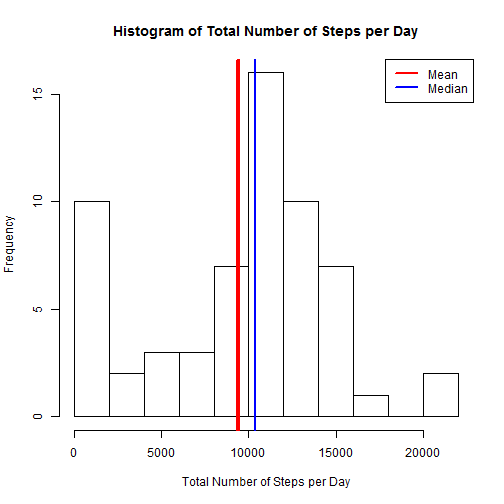
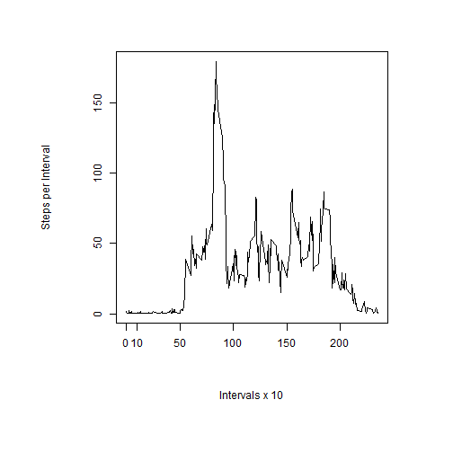
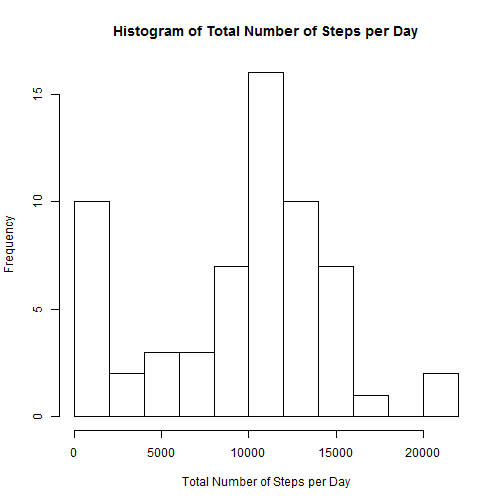
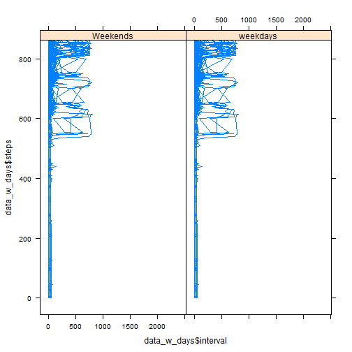

---
Course Project 1  

- 1. What is mean total number of steps taken per day?

For this part of the assignment, you can ignore the missing values in the dataset.

Calculate the total number of steps taken per day
If you do not understand the difference between a histogram and a barplot, research the difference between them. Make a histogram of the total number of steps taken each day

To find the total number of steps per day:

- Read in the data
- Convert date data in data frame to date type
- Use the aggregate function to find the total number of steps taken on each day. Note, some fields contain NA or not applicable data.
- Histogram plot


```r
library(lubridate)
data<-read.csv("activity.csv")
```

```
## Warning in file(file, "rt"): cannot open file 'activity.csv': No such file
## or directory
```

```
## Error in file(file, "rt"): cannot open the connection
```

```r
data[2]=as.Date(data$date)

sum_steps_per_day<-aggregate(data$step, by=list(data$date), sum)
names(sum_steps_per_day)=c('Date', "Total.Steps")
hist(sum_steps_per_day$Total.Steps, breaks=10, xlab="Total Number of Steps per Day", main = paste("Histogram of Total Number of Steps per Day"))
abline(v = mean(sum_steps_per_day$Total.Steps, na.rm = T), lwd=4, col="red")
abline(v = median(sum_steps_per_day$Total.Steps, na.rm = T), lwd=2, col="blue")
legend(x = "topright", c("Mean", "Median"), col = c( "red", "blue"), lwd = c(2, 2))
```



- What is the average daily activity pattern?

1. Make a time series plot (i.e. type = "l") of the 5-minute interval (x-axis) and the average number of steps taken, averaged across all days (y-axis)
2. Which 5-minute interval, on average across all the days in the dataset, contains the maximum number of steps?


```r
good_data<-complete.cases(data)
clean_data<-data[good_data,]
intervals<-aggregate(as.numeric(clean_data$steps), by=list(as.numeric(clean_data$interval)), mean)
names(intervals)<-c("Interval", "Steps")
par(mar = c(8, 8,2, 4), oma = c(2, 1, 2, 1), mgp = c(5, 1, 0))
plot(intervals$Interval/10, intervals$Steps, type="l", xlab="Intervals x 10", ylab="Steps per Interval")
axis(1, at = seq(10, 2360, by = 400))
```



Maximum 5 minutes interval which contains the highest number of steps

```r
print(intervals[which(intervals$Steps == max(intervals$Steps)),])
```

```
##     Interval    Steps
## 104      835 179.3563
```

Imputing missing values

Note that there are a number of days/intervals where there are missing values (coded as NA). The presence of missing days may introduce bias into some calculations or summaries of the data.

1. Calculate and report the total number of missing values in the dataset (i.e. the total number of rows with NAs)  

```r
nas <-data[is.na(data),]
print(nrow(nas))
```

```
## [1] 0
```

2. Devise a strategy for filling in all of the missing values in the dataset. The strategy does not need to be sophisticated. For example, you could use the mean/median for that day, or the mean for that 5-minute interval, etc.

```r
dlength<-nrow(data)
intervals_l<-nrow(intervals)
for(i in 1:intervals_l)
  for(j in 1:dlength){
    if (is.na(data[[1]][[j]])){
      data[[1]][[j]] = intervals[[2]][[i]]
    }
  }
```
3. Create a new dataset that is equal to the original dataset but with the missing data filled in.

The data was filled in from the code above.

4. Make a histogram of the total number of steps taken each day and Calculate and report the mean and median total number of steps taken per day. Do these values differ from the estimates from the first part of the assignment? What is the impact of imputing missing data on the estimates of the total daily number of steps?


```r
new_sum_steps_per_day<-aggregate(data$step, by=list(data$date), sum)
names(new_sum_steps_per_day)=c('Date', "Total.Steps")
hist(new_sum_steps_per_day$Total.Steps, breaks=10, xlab="Total Number of Steps per Day", main = paste("Histogram of Total Number of Steps per Day"))
```




- Are there differences in activity patterns between weekdays and weekends?

For this part the weekdays() function may be of some help here. Use the dataset with the filled-in missing values for this part.

1. Create a new factor variable in the dataset with two levels - "weekday" and "weekend" indicating whether a given date is a weekday or weekend day.
2. Make a panel plot containing a time series plot (i.e. type = "l") of the 5-minute interval (x-axis) and the average number of steps taken, averaged across all weekday days or weekend days (y-axis). See the README file in the GitHub repository to see an example of what this plot should look like using simulated data.


```r
library(lattice)
days_in_week<-weekdays(as.Date(data$date))
data_w_days<-cbind(data, days_in_week)
weekdays=data_w_days[which(data_w_days$days_in_week != "Sunday" | data_w_days$days_in_week != "Saturday"),]
weekends=data_w_days[which(data_w_days$days_in_week == "Sunday" | data_w_days$days_in_week == "Saturday"),]
f <- factor((data_w_days$days_in_week=="Saturday" | data_w_days$days_in_week == "Sunday"),labels =c("Weekends","weekdays"))
xyplot(data_w_days$steps ~ data_w_days$interval | f, panel = function(...) {
  panel.xyplot(data_w_days$steps, data_w_days$interval, type="l", layout="horizontal")
})
```


